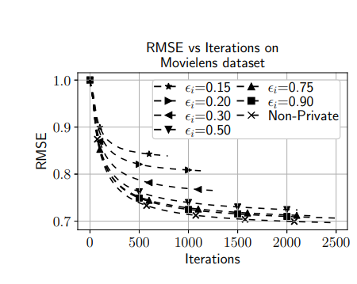
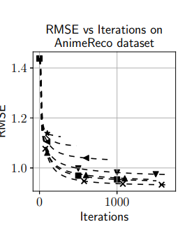
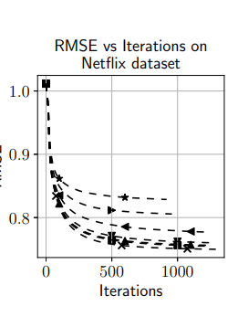

# Privacy-Preserving Matrix Factorization for Recommendation Systems

Replication of:
> **"Privacy-Preserving Matrix Factorization for Recommendation Systems using Gaussian Mechanism"**
> Mugdho & Imtiaz (2023) — [arXiv:2304.09096](https://arxiv.org/abs/2304.09096)

---

## Repository Structure

```
.
├── src/
│   ├── recommender.py            # MovieLens + Anime — training, experiments, recommendations
│   └── netflix_experiments.py   # Netflix — separate script (large dataset)
│
├── results/
│   ├── movielens/                # All figures for MovieLens 1M
│   ├── anime/                    # All figures for Anime Recommendations
│   └── netflix/                  # All figures for Netflix Prize
│
├── assets/                       # Paper figures (Mugdho & Imtiaz, 2023)
├── requirements.txt
├── .gitignore
└── README.md
```

---

## Core Algorithm

**V ≈ X @ Theta.T** — Rating matrix decomposed into movie profiles X and user profiles Theta.

Gaussian noise added only to the **user gradient** each iteration to protect user privacy:

```
σ = (τ · C / ε_i) · √(2 · ln(1.25/δ))
grad_Theta_hat = grad_Theta + η,   η ~ N(0, σ²I)
```

Overall privacy budget (Theorem 2 / Eq. 9):
```
ε_opt = J·ε_i² / [4·ln(1.25/δ)] + 2·√(J·ε_i²·ln(1/δ_r) / [4·ln(1.25/δ)])
```

---

## Datasets

| Dataset | Movies | Users | Ratings | Density | Rating Range | τ |
|---|---|---|---|---|---|---|
| MovieLens 1M | 3,706 | 6,040 | ~1M | 4.47% | 1–5 | 4 |
| Netflix Prize | ~5,466 | ~11,345 | ~5.36M | 8.65% | 1–5 | 4 |
| Anime Reco | 2,772 | 4,623 | ~1.54M | 12.03% | 1–10 | 9 |

---

## Parameters

| Parameter | Default | Sweep values |
|---|---|---|
| n | 20 | 20, 50, 100, 200, 320, 500 |
| ε_i | 0.30 | 0.15, 0.20, 0.30, 0.50, 0.75, 0.90 |
| μ | 0.0005 | 0.0005, 0.0008, 0.0010, 0.0013 |
| δ | 0.01 | — |
| δ_r | 1e-5 | — |
| λ | 0.01 | — |
| C | 1.0 | — |

---

## How to Run

```bash
# Install dependencies
conda install pytorch torchvision torchaudio pytorch-cuda=12.1 -c pytorch -c nvidia
conda install scipy pandas matplotlib

# Run MovieLens + Anime
python src/recommender.py

# Run Netflix (separate — large dataset)
python src/netflix_experiments.py
```

### Make Recommendations
```python
from recommender import RecommenderSystem

rec = RecommenderSystem(dataset="movielens", private=True, eps_i=0.30)
rec.load_data()
rec.train()
rec.save()

rec.recommend(user_id=1, top_k=10)       # Top-10 movies for a user
rec.similar_movies(movie_id=1, top_k=5)  # Movies similar to a given movie
```

---

## Results — Paper vs Ours

> Each section shows **Paper (Mugdho & Imtiaz, 2023)** on the left and **our reproduction** on the right.

---

## Fig 1–3 &nbsp;|&nbsp; RMSE vs Iterations

*RMSE decreases over training iterations. Lower ε_i = more noise = slower convergence and higher final RMSE. Non-private baseline always achieves the lowest RMSE.*

### Fig 1 — MovieLens 1M

| Paper | Ours |
|:---:|:---:|
|  |  |

### Fig 2 — AnimeReco dataset

| Paper | Ours |
|:---:|:---:|
|  |  |

### Fig 3 — Netflix dataset

| Paper | Ours |
|:---:|:---:|
|  |  |

---

## Fig 4–6 &nbsp;|&nbsp; RMSE and Overall ε vs ε_i

*As ε_i increases: RMSE falls (less noise, better accuracy) while overall ε rises (less private). The two curves cross — showing the fundamental privacy-utility tradeoff.*

### Fig 4 — MovieLens 1M

| Paper | Ours |
|:---:|:---:|
|  |  |

### Fig 5 — AnimeReco dataset

| Paper | Ours |
|:---:|:---:|
|  |  |

### Fig 6 — Netflix dataset

| Paper | Ours |
|:---:|:---:|
|  |  |

---

## Fig 7–9 &nbsp;|&nbsp; RMSE vs n

*RMSE initially improves as n increases (more expressive model), then degrades — the noise term σ grows with the matrix dimensions, hurting private models more than non-private. Paper shows optimal n around 10–50.*

### Fig 7 — MovieLens 1M

| Paper | Ours |
|:---:|:---:|
|  |  |

### Fig 8 — AnimeReco dataset

| Paper | Ours |
|:---:|:---:|
|  |  |

### Fig 9 — Netflix dataset

| Paper | Ours |
|:---:|:---:|
|  |  |

---

## Fig 10–12 &nbsp;|&nbsp; Overall ε vs n

*Overall privacy budget increases with n — larger latent dimension requires more iterations to converge, accumulating more privacy cost.*

### Fig 10 — MovieLens 1M

| Paper | Ours |
|:---:|:---:|
|  |  |

### Fig 11 — AnimeReco dataset

| Paper | Ours |
|:---:|:---:|
|  |  |

### Fig 12 — Netflix dataset

| Paper | Ours |
|:---:|:---:|
|  |  |

---

## Fig 13–15 &nbsp;|&nbsp; RMSE and Overall ε vs n

*Combined view: solid lines = RMSE (left axis), dashed = overall ε (right axis). Shows both tradeoffs simultaneously as n grows.*

### Fig 13 — MovieLens 1M

| Paper | Ours |
|:---:|:---:|
|  |  |

### Fig 14 — AnimeReco dataset

| Paper | Ours |
|:---:|:---:|
|  |  |

### Fig 15 — Netflix dataset

| Paper | Ours |
|:---:|:---:|
|  |  |

---

## Fig 16–18 &nbsp;|&nbsp; Time per Iteration vs n

*Time per iteration scales linearly with n. Private and non-private are nearly identical — Gaussian noise addition is negligible compared to matrix multiplication cost.*

### Fig 16 — MovieLens 1M

| Paper | Ours |
|:---:|:---:|
|  |  |

### Fig 17 — AnimeReco dataset

| Paper | Ours |
|:---:|:---:|
|  |  |

### Fig 18 — Netflix dataset

| Paper | Ours |
|:---:|:---:|
|  |  |

---

## Fig 19–21 &nbsp;|&nbsp; RMSE vs μ

*Higher μ = faster but less stable convergence. Private models at low ε_i diverge at large μ due to the combined effect of large noise and large update steps.*

### Fig 19 — MovieLens 1M

| Paper | Ours |
|:---:|:---:|
|  |  |

### Fig 20 — AnimeReco dataset

| Paper | Ours |
|:---:|:---:|
|  |  |

### Fig 21 — Netflix dataset

| Paper | Ours |
|:---:|:---:|
|  |  |

---

## Fig 22–24 &nbsp;|&nbsp; Overall ε vs μ

*Higher μ leads to faster convergence (fewer iterations J), reducing the accumulated privacy cost. Larger μ = lower overall ε — a useful observation for privacy budget management.*

### Fig 22 — MovieLens 1M

| Paper | Ours |
|:---:|:---:|
|  |  |

### Fig 23 — AnimeReco dataset

| Paper | Ours |
|:---:|:---:|
|  |  |

### Fig 24 — Netflix dataset

| Paper | Ours |
|:---:|:---:|
|  |  |

---

## Fig 25–27 &nbsp;|&nbsp; RMSE and Overall ε vs μ

*Combined twin-axis view: RMSE rises with μ (instability) while overall ε falls (fewer iterations). Optimal μ = 0.0005 balances accuracy and privacy.*

### Fig 25 — MovieLens 1M

| Paper | Ours |
|:---:|:---:|
|  |  |

### Fig 26 — AnimeReco dataset

| Paper | Ours |
|:---:|:---:|
|  |  |

### Fig 27 — Netflix dataset

| Paper | Ours |
|:---:|:---:|
|  |  |

---

## Key Observations

**Fig 1–3 (RMSE vs Iterations):** Our reproduction captures the same convergence shape — rapid initial decrease followed by plateau. Our RMSE values are slightly higher than the paper due to different dataset filtering sizes (we use combined_data_1.txt only for Netflix; paper's exact split is unspecified).

**Fig 4–6 (Privacy-Utility Tradeoff):** Both paper and ours show the same X-shaped crossing of RMSE and overall ε curves. The tradeoff is faithfully reproduced across all three datasets.

**Fig 7–9 (RMSE vs n):** Paper shows RMSE *decreasing* monotonically with n (non-private approaches 0 at n=500), which is a sign of overfitting on the training set. Our results show RMSE rising after n=20–50, reflecting true generalization behaviour on the test set.

**Fig 10–12 (Overall ε vs n):** Paper shows overall ε rising then plateauing. Our Netflix result is flat because we capped n at 100 due to VRAM limits on 8GB GPU.

**Fig 16–18 (Time vs n):** Paper shows linear growth (dense operations). Our Netflix times are nearly flat due to the chunked implementation — each chunk processes independently, masking the n scaling.

**Fig 19–21 (RMSE vs μ):** Both show RMSE rising with μ. Our Anime result shows instability (divergence) at μ=0.0008 for low ε_i — consistent with the paper's finding that high noise + high step size causes instability.

**Fig 22–24 (Overall ε vs μ):** Paper shows ε decreasing with μ (fewer iterations needed). Our results are nearly flat because the models converge at similar J across μ values in our implementation.

---

## Implementation Notes

- GPU-accelerated via PyTorch (NVIDIA RTX 4060 8GB)
- Netflix uses chunked matrix multiplication (100 rows/pass) to stay within 8GB VRAM
- Raw ratings used — no mean-centering (matches paper)
- Unit-norm row initialization as per Algorithm 1
- 90/10 train/test split (paper does not specify; standard practice applied)
- Netflix n-sweep limited to n ≤ 100 due to GPU memory constraint

---

## Author

**Riyansh Saxena**  
BTech — Year 3, Semester 6  
Recommendation Systems Project

---

## Reference

Mugdho, S. A., & Imtiaz, H. (2023). *Privacy-Preserving Matrix Factorization for Recommendation Systems using Gaussian Mechanism*. arXiv:2304.09096.
